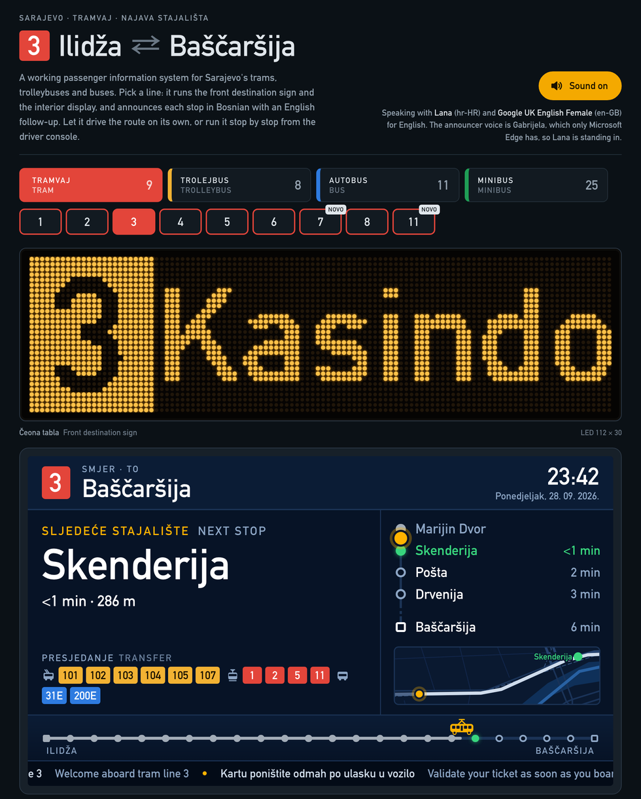

# Sarajevo Tram, Trolleybus and Bus Announcer

## [▶ Open the announcer](https://nedimsladic.github.io/sarajevo-announcer/)

It runs in the browser: nothing to download or install, and no account needed. On a phone, scan the code:

## Using it

1. Pick a tram, trolleybus, bus or minibus line under the title.
2. Click **Enable sound** (top right) to hear each stop announced in Bosnian, with an English follow-up.
3. Press **Depart** on the driver console, then **Arrive** at each stop, or switch on **Auto run** and pick a speed.

To open a line directly, add its number to the link: [tram 3](https://nedimsladic.github.io/sarajevo-announcer/#3), [tram 7](https://nedimsladic.github.io/sarajevo-announcer/#7), [trolleybus 103](https://nedimsladic.github.io/sarajevo-announcer/#103), [bus 31E](https://nedimsladic.github.io/sarajevo-announcer/#31E).

Stop names sound best in Microsoft Edge, which has the Croatian voice Gabrijela. Other browsers use whichever Bosnian, Croatian or Serbian voice the device has.

## Offline

`index.html` is the whole app in one file. [Download the ZIP](https://github.com/nedimsladic/sarajevo-announcer/archive/refs/heads/main.zip), unzip it and double-click `index.html`. It runs without a server; the internet is only used for the lettering font.

---

An unofficial demonstration, not affiliated with GRAS. Stop positions and route geometry © [OpenStreetMap](https://www.openstreetmap.org/copyright) contributors, ODbL.
